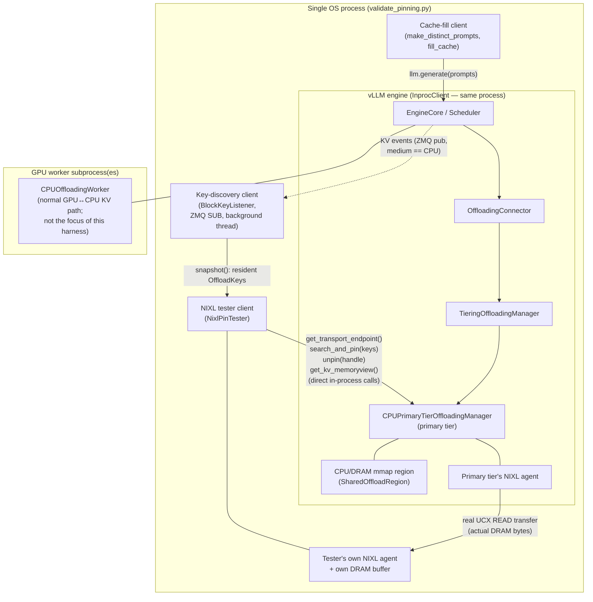
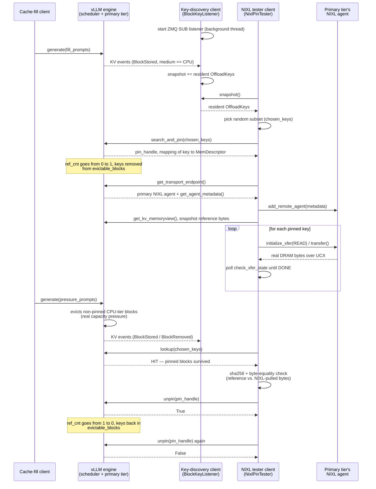

# Primary-Tier Pinning: Real-Engine NIXL Validation

`validate_pinning.py` proves that `CPUPrimaryTierOffloadingManager`'s
`search_and_pin` / `unpin` / `get_transport_endpoint` API (see
`plans/vllm_primary_tier_pinning_api.md`) works correctly against a real,
running vLLM engine doing real inference, using a genuinely separate NIXL
agent to pull bytes over a real UCX transfer — not the mocked
`SharedOffloadRegion` used by
`tests/v1/kv_offload/tiering/test_primary_tier_pinning_nixl.py`.

Design doc:
`docs/superpowers/specs/2026-07-02-primary-tier-pinning-nixl-e2e-design.md`.

## Requirements

- A real GPU.
- A real NIXL/UCX installation (`nixl` or `rixl` importable).
- A vLLM build against this checkout. On this box:
  `/images/nixl/venv-vllm-cu/bin/python`.

This is a manual, opt-in script — it is **not** part of the default pytest
suite (it needs a GPU, downloaded model weights, and real NIXL).

## Running it

```bash
/images/nixl/venv-vllm-cu/bin/python \
  tests/v1/kv_offload/kvcc-tests/pinning/validate_pinning.py \
  --model Qwen/Qwen3-0.6B-FP8 --cpu-offload-gb 0.1 --num-pins 5
```

Self-test only (no GPU/NIXL needed — checks the KV-events decode path):

```bash
/images/nixl/venv-vllm-cu/bin/python \
  tests/v1/kv_offload/kvcc-tests/pinning/validate_pinning.py --selftest
```

Exit code `0` and `ALL CHECKS PASSED` mean every assertion below held. A
non-zero exit and a `FAILED:`/`ERROR:` line on stderr identify which check
failed.

## Why one process, not `vllm serve` + separate clients

`search_and_pin`/`unpin`/`get_transport_endpoint` are plain in-process
Python methods on the scheduler's `CPUPrimaryTierOffloadingManager`. There is
no existing RPC/HTTP surface that lets an external process call them —
adding one would be new production code, out of scope here. So this script
runs the engine with `vllm.LLM(...)` and reaches the manager directly.
`VLLM_ENABLE_V1_MULTIPROCESSING` defaults to `True` (`vllm/envs.py`), so
`vllm.LLM` does **not** default to the in-process `InprocClient` — the
script sets `VLLM_ENABLE_V1_MULTIPROCESSING=0` itself, at the top of the
file, before `import vllm`, the same way it sets
`VLLM_KV_EVENTS_USE_INT_BLOCK_HASHES`:

```python
engine_core = llm.llm_engine.engine_core.engine_core   # InprocClient -> EngineCore
connector = engine_core.scheduler.get_kv_connector()    # OffloadingConnector
manager = connector.connector_scheduler.manager          # TieringOffloadingManager
primary_tier = manager.primary_tier                       # CPUPrimaryTierOffloadingManager
```

GPU workers still run in real subprocesses via the normal executor; only the
scheduler/manager stays in this process.

## Architecture



Everything except the GPU workers lives in one OS process (see "Why one
process" above), but the three client roles are kept as separate components
with no shared state beyond what's shown: the key-discovery client only
ever sees the ZMQ wire, and the NIXL tester only reaches the primary tier
through the same three APIs an external caller would use.

## Workflow



## The three roles

Even though everything runs in one process, the script keeps three
components with distinct responsibilities:

### 1. Cache-fill client (`make_distinct_prompts` + `fill_cache`)

Plain `llm.generate([...])` calls with several long, distinct-content
prompts. `.generate()` is a real vLLM client interface — no HTTP server is
needed.

GPU→CPU offload here is **write-through, not GPU-pressure-driven**:
`OffloadingConnectorScheduler.build_connector_meta()` calls
`_build_store_jobs()` unconditionally every scheduler step
(`vllm/distributed/kv_transfer/kv_connector/v1/offloading/scheduler.py:844`),
which stores every newly-computed prefill block of every in-flight request
to the CPU tier immediately — there's no "wait for GPU memory pressure"
gate. `TieringOffloadingSpec` also forces `store_threshold=1`
(`spec.py:178` rejects `>= 2`), so there's no repeated-access requirement
either. So getting blocks into the CPU tier only needs `--cpu-offload-gb`
> 0 and prompts long enough to span at least one full KV block — trivially
true for `make_distinct_prompts()`'s few-thousand-character filler.
`--gpu-memory-utilization` / `--num-gpu-blocks` don't affect whether
offload happens; they're only set small to keep the test's GPU footprint
and startup time down.

Because this is the synchronous offline engine, nothing else steps the
scheduler between calls — state is stable the moment `.generate()` returns.

#### How `build_llm()` ensures this

Write-through isn't a flag the script flips — `_build_store_jobs()` has no
non-write-through code path, so there's nothing to turn on. What
`build_llm()` actually has to get right is making that path reachable and
unobstructed:

```python
kv_transfer_config = KVTransferConfig(
    kv_connector="OffloadingConnector",
    kv_role="kv_both",
    kv_connector_extra_config={
        "spec_name": "TieringOffloadingSpec",
        "cpu_bytes_to_use": args.cpu_offload_gb * (1 << 30),
        "enable_external_pinning": True,
    },
)
...
return LLM(..., enable_prefix_caching=True, ...)
```

1. **`kv_connector="OffloadingConnector"`** activates
   `OffloadingConnectorScheduler`, the class whose `build_connector_meta()`
   unconditionally calls `_build_store_jobs()` every step. Selecting a
   different connector would mean this write-through path doesn't exist at
   all in the running engine.
2. **`spec_name="TieringOffloadingSpec"`** — required for
   `search_and_pin`/`unpin`/`get_transport_endpoint` to exist on the
   manager at all (the default `CPUOffloadingSpec` doesn't have them). Side
   effect relevant here: this spec (`spec.py:178`) actively *rejects* any
   config that raises `store_threshold >= 2`, so there's no way to
   accidentally turn write-through into "store only after N repeated
   accesses" while using it — `store_threshold` stays pinned at its
   default of `1`.
3. **`cpu_bytes_to_use` > 0** (via `--cpu-offload-gb`) — gives the CPU tier
   nonzero capacity. Without this, `prepare_store` has nowhere to put
   blocks and every store attempt fails regardless of write-through being
   architecturally "on".
4. **`enable_prefix_caching=True`** — `_build_store_jobs()` needs each
   request's per-block hashes (`req.block_hashes`) to build `OffloadKey`s;
   that hashing infrastructure is shared with GPU prefix caching, so it has
   to be enabled for the connector to have anything to offload.

Notably absent from this list: `--gpu-memory-utilization` /
`--num-gpu-blocks`. They're set small purely to keep the test's GPU
footprint and startup time down — `_build_store_jobs()` never checks GPU
cache pressure, so they have no bearing on whether write-through offload
happens.

The script's only *runtime* confirmation that this actually worked is
empirical, not configured: after the first `fill_cache()` call, `run()`
waits for `BlockKeyListener.snapshot()` to become non-empty and prints
`"Discovered N resident CPU-tier block keys"`. If the connector/spec wiring
were wrong, or `cpu_bytes_to_use` were `0`, that set would stay empty and
`run()` raises `RuntimeError("No blocks observed in the CPU tier. ...")`
instead of silently continuing — see Troubleshooting.

### 2. Key-discovery client (`BlockKeyListener`)

A standalone component that never touches the manager object — it only
listens on the KV-events ZMQ endpoint (`kv_events_config` with
`enable_kv_cache_events=True`), running in a background thread started
before any generation happens. It filters `BlockStored`/`BlockRemoved`
events by `medium == "CPU"` (primary-tier offload events; vLLM's separate
GPU prefix-cache event stream uses `medium == "GPU"`) and reconstructs an
`OffloadKey` via `make_offload_key(hash, group_idx)` for every hash in each
event's `block_hashes` — a single `BlockRemoved` can batch multiple
distinct evicted keys under one `group_idx`, so a `[0]`-only read would
silently drop the rest (this was a real bug found during GPU verification;
see Troubleshooting).

This requires setting `VLLM_KV_EVENTS_USE_INT_BLOCK_HASHES=0` **before**
importing vLLM: by default (`"1"`), KV events carry a lossy 64-bit int digest
of the block hash instead of the raw bytes, which makes exact `OffloadKey`
reconstruction impossible. The script sets this env var itself, at the top
of the file, before `import vllm`.

`listener.snapshot()` returns the current set of resident `OffloadKey`s —
the concrete "show me the block keys of the blocks stored in the DRAM
cache" mechanism, implemented the way an external, out-of-process observer
would consume it in production.

### 3. NIXL tester client (`NixlPinTester`)

Owns a second, genuinely separate `nixl_agent` and its own DRAM `numpy`
buffer. This is where the three APIs under test are called directly:

- **`get_transport_endpoint()`** — called once, inside `pin_and_transfer`, to
  obtain the primary tier's real NIXL agent object and its
  `get_agent_metadata()`, which the tester agent loads via
  `add_remote_agent(...)` so it can address the primary tier as a remote
  peer.
- **`search_and_pin(keys)`** — called with a random subset of the
  key-discovery client's snapshot. Before calling it, the script asserts
  every chosen block currently has `ref_cnt == 0`. After it returns, the
  script asserts the **non-evictable transition**: each block's `ref_cnt`
  is `1`, the key is no longer in `_policy.evictable_blocks`, and
  `_num_evictable_cache_blocks` dropped by exactly the number of pinned
  keys.
- Real UCX transfer — for each returned `MemDescriptor`, the tester agent
  issues a `READ` (`initialize_xfer` → `transfer` → poll
  `check_xfer_state` until `"DONE"`), pulling bytes from the primary tier's
  real DRAM into its own buffer.
- **Survival under real competing load**: after pinning, the harness calls
  `fill_cache` again with a fresh batch of distinct prompts. This is a
  different mechanism from the write-through GPU→CPU store above: it's
  meant to fill the CPU tier itself past `--cpu-offload-gb` capacity
  (default kept small, `0.1` GB, precisely so this batch forces a real
  CPU-tier eviction), and then asserts every pinned key is still
  `lookup(...) is LookupResult.HIT` — proving `search_and_pin` protects
  blocks against real internal eviction decisions made by the live engine,
  not just isolated bookkeeping.
- **Correctness check**: a reference copy of each pinned block's bytes was
  taken via `primary_tier.get_kv_memoryview()` *before* the transfer (safe,
  since nothing else steps the engine while the harness holds control).
  The script computes a `sha256` checksum of that reference and of the
  NIXL-pulled buffer and asserts they match (plus a direct byte-equality
  check as a cheap extra) — proving the descriptor's
  `addr`/`size`/`device_Id` addressed the right bytes and the real UCX
  transfer preserved them exactly.
- **`unpin(pin_handle)`** — called once all of the above pass. Asserts it
  returns `True`, then asserts the **evictable transition**: each block's
  `ref_cnt` is back to `0`, the key is back in `_policy.evictable_blocks`,
  and `_num_evictable_cache_blocks` rose by exactly the number of unpinned
  keys. Finally calls `unpin(pin_handle)` a second time and asserts it
  returns `False` (handle already released).

## Tuning cache pressure

If the run fails with "No blocks observed in the CPU tier": GPU→CPU offload
is write-through (see above), so this isn't a GPU-cache-sizing problem.
Check `--cpu-offload-gb` is `> 0` and `--num-fill-prompts` is at least `1`
— each prompt already produces far more than one block's worth of tokens.

If the "Pinned blocks survived real competing eviction pressure" step
passes trivially even when it shouldn't (i.e. you suspect no CPU-tier
eviction actually happened during the pressure batch), raise
`--num-pressure-prompts` and/or lower `--cpu-offload-gb` so the pressure
batch's total block volume exceeds CPU-tier capacity.

## Troubleshooting

- `RuntimeError: NIXL is not installed` — run with a Python that has a real
  `nixl`/`rixl` package (e.g. `/images/nixl/venv-vllm-cu/bin/python`).
- `Expected an in-process InprocClient` — the script sets
  `VLLM_ENABLE_V1_MULTIPROCESSING=0` itself before importing vLLM; this
  error means something in your environment overrode it back to a truthy
  value (e.g. `VLLM_ENABLE_V1_MULTIPROCESSING=1` already exported and a
  non-default `os.environ.setdefault` interaction) -- unset it and rerun.
- `ValueError: To serve at least one request with the model's max seq
  len ... available KV cache memory` at engine startup — the model's own
  default `max_model_len` (40960 for Qwen3-0.6B-FP8) needs far more KV
  cache than `--num-gpu-blocks`'s tiny default provides; vLLM's startup
  check sizes required cache off `max_model_len`, not off actual prompt
  length. Fixed by this script's `--max-model-len` default (2048) --
  raise `--num-gpu-blocks` and/or lower `--max-model-len` further if you
  change either default and hit this again (need
  `num_gpu_blocks * 16 >= max_model_len`, 16 tokens/block for this model).
- `FAILED: key ... not found in primary tier` right after a large
  "Discovered N resident CPU-tier block keys" count — a prior version of
  `BlockKeyListener` only read `block_hashes[0]` per event, so a single
  `BlockRemoved` batching multiple evicted keys under one `group_idx`
  looked like it removed just one key, inflating the "resident" set with
  keys already evicted for real. Fixed by iterating every hash in
  `event.block_hashes`; if you see this, check for a regression there.
- `WARNING ... scheduler.py:928 ... Request ...: cannot store blocks` — this
  is vLLM's own scheduler, not the harness, logging that
  `CPUOffloadingManager.prepare_store` returned `None` because the CPU tier
  couldn't evict enough room for a block in that scheduling step
  (`vllm/v1/kv_offload/cpu/manager.py`'s `prepare_store`, the
  `num_blocks_to_evict > self._num_evictable_cache_blocks` branch). This is
  **expected** given `--cpu-offload-gb` is deliberately small: it happens
  more once blocks are pinned (never evictable) and especially during the
  pressure batch, which exists specifically to force real eviction. It is
  not a failure signal — the script prints an explanatory note right
  before each `fill_cache()` call for this reason.
